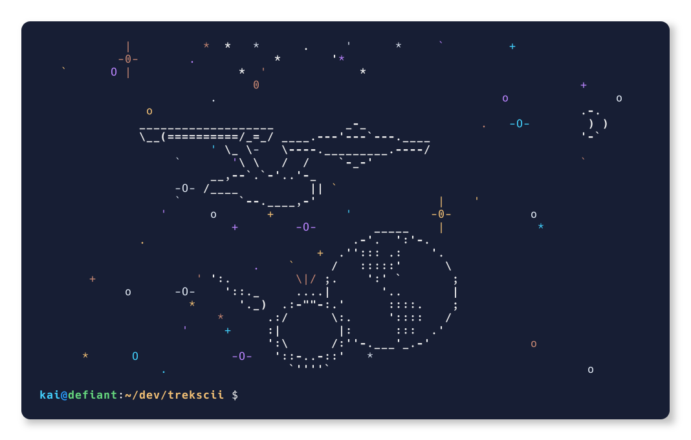

# trekscii

An ASCII Star Trek scene generator!


## Compilation

In the root project directory:

```
$ make
# make install
```

## Usage

```bash
trekscii [height] [width]
```

`height` and `width` must be larger than `16` and `46`, respectively. If not
specified, they will default to half the respective terminal dimension.

e.g.

```bash
trekscii 25 85                         # fixed dimensions
trekscii 35 $(tput cols)               # terminal width, fixed height
trekscii $(tput lines) $(tput cols)    # full-terminal
trekscii $(tput lines)                 # full-terminal height, half-terminal width
trekscii                               # half-terminal height, half-terminal width
```
